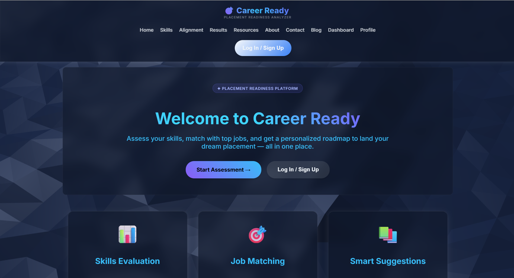
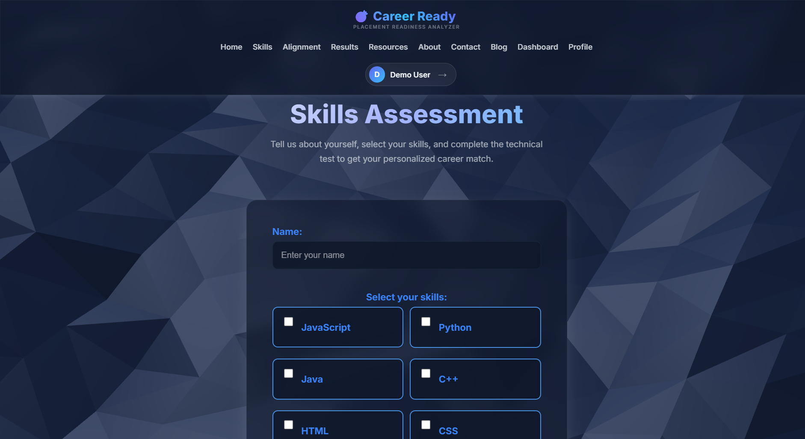
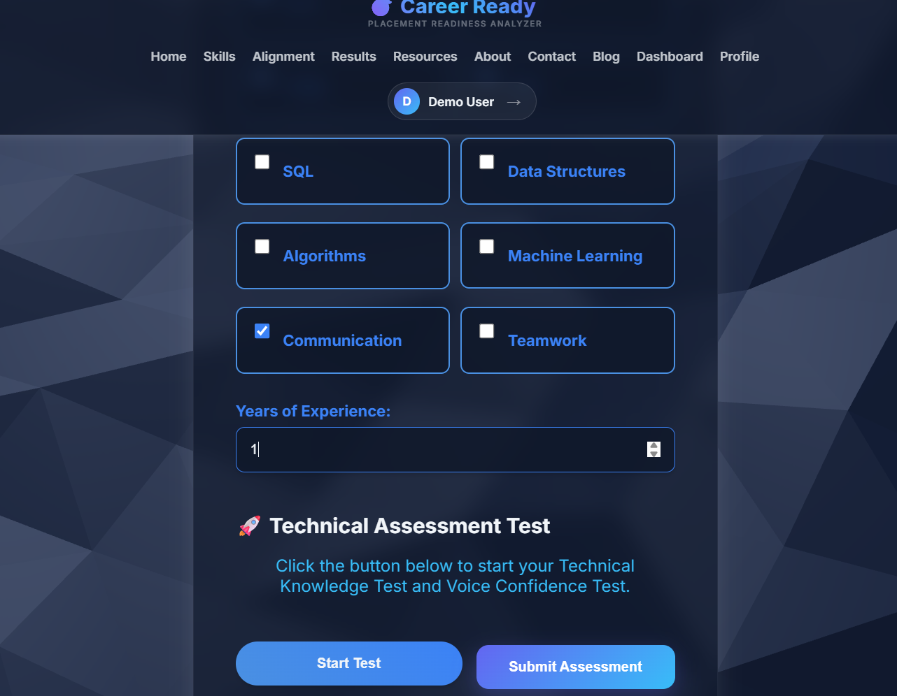
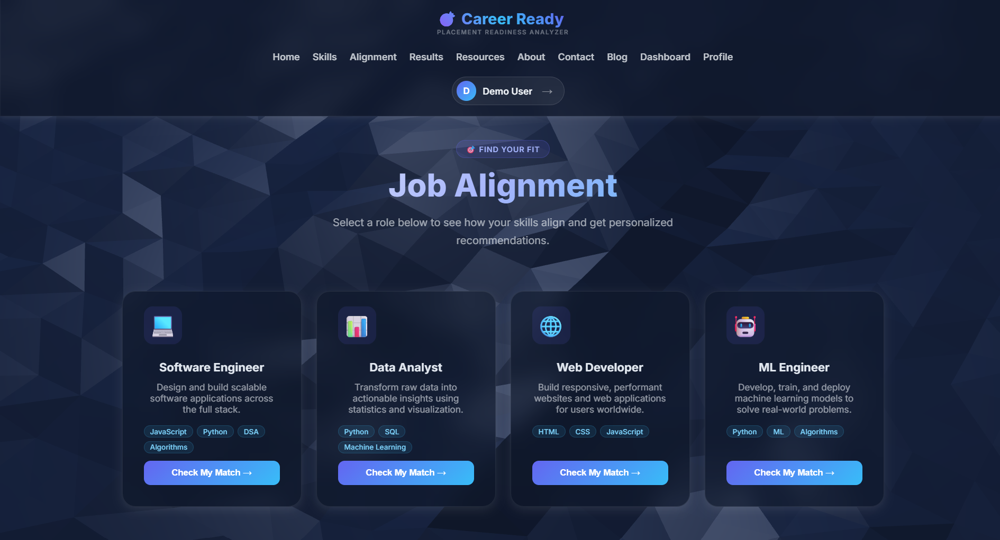
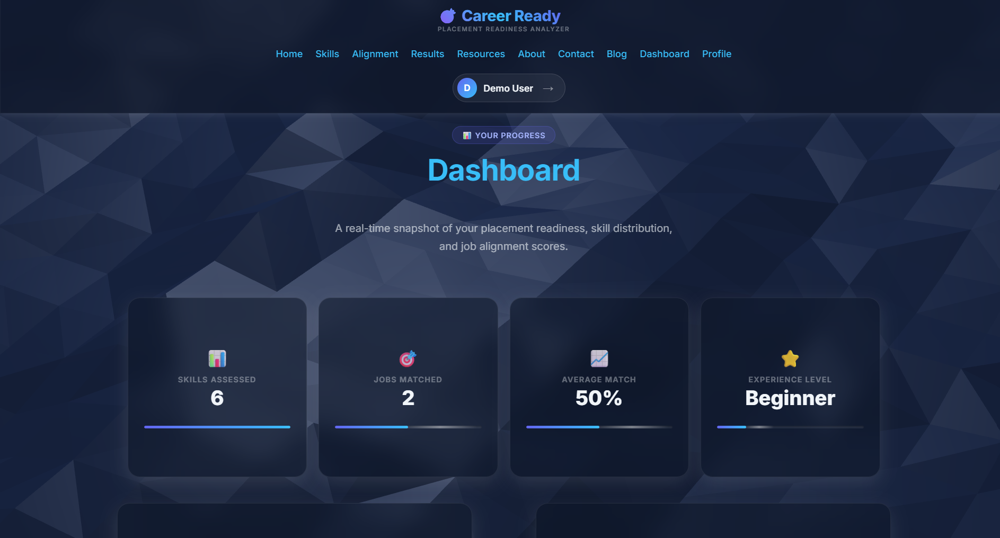
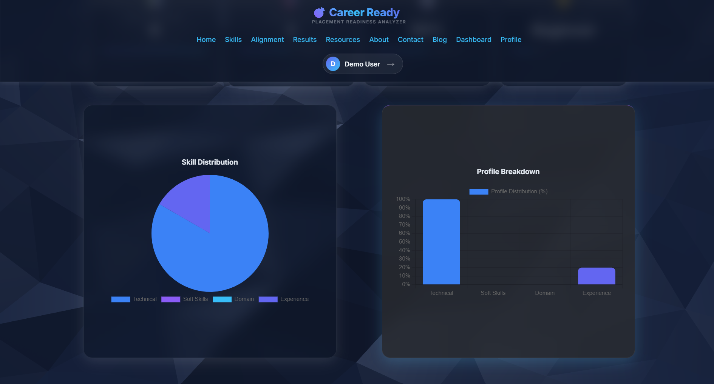
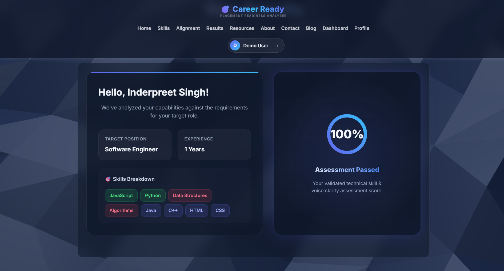
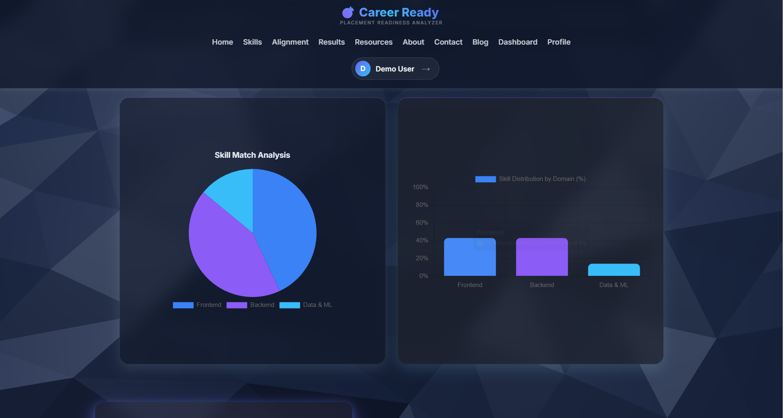

# 🎯 Career Ready – Placement Readiness Dashboard

<div align="center">

A modern web-based placement preparation platform that helps students evaluate their placement readiness through interactive skill assessments, job-role recommendations, voice confidence analysis, and performance analytics.


### 🌐 Live Demo

👉 **[Visit Career Ready](https://feeproject-flame.vercel.app/)**

</div>

---

# 📑 Table of Contents

- [📖 About the Project](#-about-the-project)
- [🎯 Problem Statement](#-problem-statement)
- [✨ Features](#-features)
- [🛠️ Tech Stack](#️-tech-stack)
- [🚀 Application Workflow](#-application-workflow)
- [📸 Project Screenshots](#-project-screenshots)
- [⚙️ Installation](#️-installation)
- [🎯 Learning Outcomes](#-learning-outcomes)
- [💡 Key Highlights](#-key-highlights)
- [🔮 Future Improvements](#-future-improvements)
- [👥 Team](#-team)
- [📄 License](#-license)

---

# 📖 About the Project

Career Ready is a responsive front-end web application developed as part of the **Front-End Engineering (FEE)** course.

The platform is designed to help students prepare for placements by combining technical assessments, communication analysis, job-role recommendations, learning resources, and interactive dashboards into a single application.

The project demonstrates modern frontend development practices including responsive UI design, browser APIs, interactive data visualization, and client-side data management.

---

# 🎯 Problem Statement

Students preparing for placements often need multiple websites for technical assessments, career guidance, learning resources, and progress tracking.

Career Ready brings these essential features together into one platform, providing an organized and interactive placement preparation experience.

---

# ✨ Features

## 📝 Assessment

- Interactive Technical Skills Assessment
- Technical MCQ Test
- Voice Confidence Analysis using Web Speech API
- Personalized Skill Evaluation

## 💼 Career Guidance

- Job Role Matching
- Personalized Learning Resources
- Career Blog

## 📊 Analytics

- Interactive Dashboard
- Dynamic Charts using Chart.js
- Performance Visualization
- Placement Readiness Tracking

## 👤 User Features

- User Login & Registration UI
- Profile Management
- LocalStorage & SessionStorage Integration
- Responsive User Interface

---

# 🛠️ Tech Stack

| Category | Technologies |
|----------|--------------|
| **Frontend** | HTML5, CSS3, JavaScript (ES6) |
| **Libraries** | Chart.js, Vanta.js, Three.js |
| **Browser APIs** | Web Speech API, LocalStorage API, SessionStorage API |
| **Deployment** | Vercel |
| **Version Control** | Git & GitHub |
| **Development Tools** | Visual Studio Code |

---

# 🚀 Application Workflow

```text
User Login
      │
      ▼
Skills Assessment
      │
      ▼
Technical Assessment
      │
      ▼
Voice Confidence Analysis
      │
      ▼
Job Role Matching
      │
      ▼
Dashboard Analytics
      │
      ▼
Results & Performance Analysis
      │
      ▼
Learning Resources
```

---

# 📸 Project Screenshots

## 🏠 Home Page



---

## 📝 Skills Assessment

### Step 1 – User Information & Skill Selection



### Step 2 – Technical Assessment & Experience



---

## 💼 Job Alignment



---

## 📊 Dashboard Overview



---

## 📈 Dashboard Analytics



---

## 🎯 Results Overview



---

## 📉 Results Analytics



---

# ⚙️ Installation

## Clone the repository

```bash
git clone https://github.com/inderpreet-singh1/career-ready.git
```

## Navigate into the project

```bash
cd career-ready
```

## Run the project

Open **index.html** in your preferred web browser.

Or use the **Live Server** extension in **Visual Studio Code** for the best development experience.

---

# 🎯 Learning Outcomes

This project helped strengthen my understanding of:

- Responsive Web Design
- HTML5 Semantic Structure
- Modern CSS3 Styling
- JavaScript DOM Manipulation
- Browser Storage APIs
- Web Speech API
- Authentication UI Design
- Interactive Data Visualization
- Chart.js Integration
- Responsive UI Development
- Git & GitHub Version Control
- Project Deployment using Vercel

---

# 💡 Key Highlights

- Responsive multi-page web application
- Interactive placement assessment system
- Voice confidence analysis using browser APIs
- Dynamic dashboard powered by Chart.js
- Personalized job-role recommendations
- Modern animated user interface
- Client-side data persistence using LocalStorage
- Live project deployed on Vercel

---

# 🔮 Future Improvements

- - Backend integration using Flask or Node.js
- Database connectivity (SQLite / MongoDB)
- Resume ATS compatibility checker
- AI-powered career recommendations
- Firebase Authentication
- Company Job API integration
- Interview Preparation Chatbot
- Progress tracking across multiple sessions
- Personalized AI study plans

---

# 👥 Team

This project was developed collaboratively by:

- **Inderpreet Singh**
- **Avreet Kaur**
- **Gurjot Kaur**

---

# 📄 License

This project was developed for educational purposes as part of the **Front-End Engineering (FEE)** course and is shared for learning and portfolio purposes.

---

<div align="center">

### ⭐ If you found this project interesting, consider giving it a Star!

Made with ❤️ using HTML, CSS & JavaScript

</div>